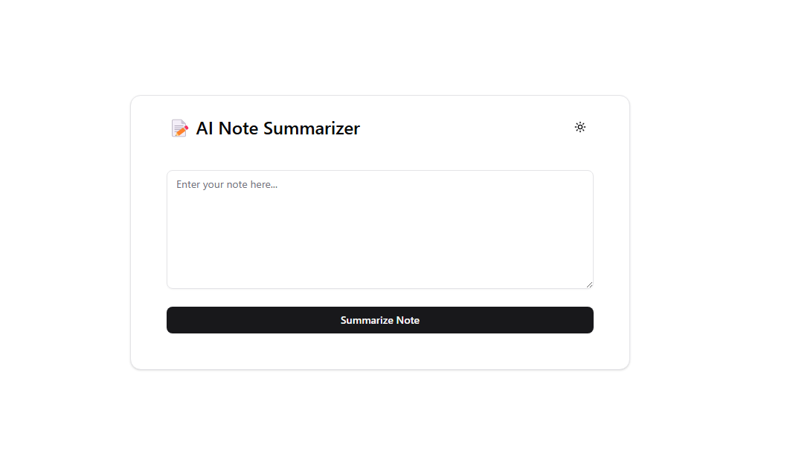
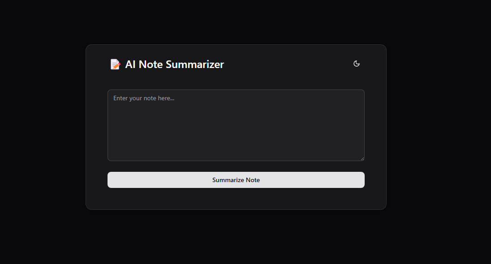

# 📝 AI Note Summarizer

AI-powered note summarization app built with **Next.js**, **TailwindCSS**, **TypeScript**, and **Google Gemini API**.  
Users can paste or type long-form notes, and the app instantly returns a concise summary using Google's AI.

---

## 🚀 Features

- 🧠 Summarize notes using **Gemini (Gemini 2.0 Flash)** API
- 💨 Built with **Next.js App Router** + API routes
- 🎨 Styled using **TailwindCSS** + **shadcn/ui** components
- 🌗 Fully responsive with **Dark Mode** support
- ⚡️ Clean UI, loading state, and error handling
- 📦 Scalable and ready for note-saving, export, or backend integration

---

## 📷 Preview




---

## 🛠️ Tech Stack

- [Next.js](https://nextjs.org/) (App Router + API routes)
- [TypeScript](https://www.typescriptlang.org/)
- [TailwindCSS](https://tailwindcss.com/)
- [shadcn/ui](https://ui.shadcn.com/)
- [next-themes](https://github.com/pacocoursey/next-themes)
- [Google Generative AI](https://ai.google.dev/)

---

## 🧪 Local Setup

```bash
git clone https://github.com/your-username/ai-note-summarizer.git
cd ai-note-summarizer

# Install dependencies
npm install

# Add your Gemini API key
touch .env.local
echo "GEMINI_API_KEY=your_real_key_here" > .env.local

# Run the app
npm run dev
